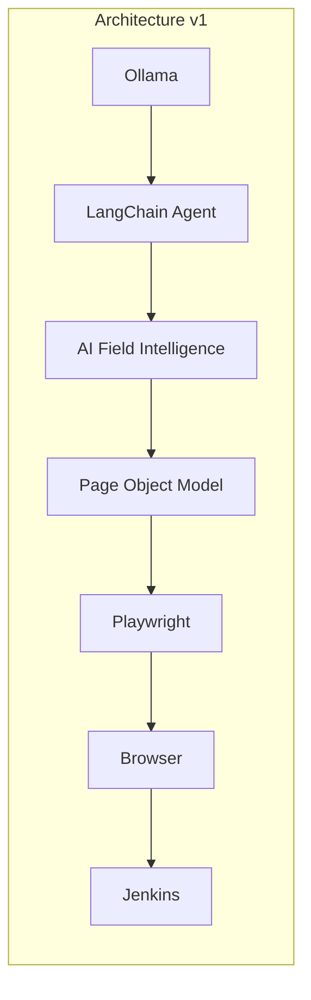
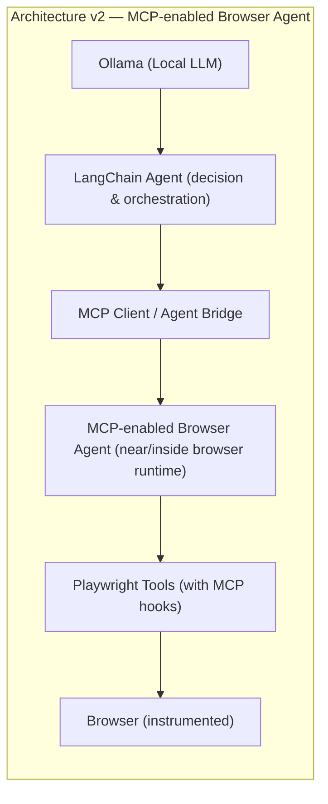

# 🤖 Autonomous Web AI Agent (Playwright + Local LLM)

An enterprise-ready architectural sample demonstrating how to integrate **Playwright** with **Large Language Models (LLMs)** for autonomous web automation and self-healing test scenarios.

## 🚀 Features & Visibility Highlights
* **100% Free & Open-Source:** Utilizes **Ollama** locally—no paid OpenAI or Anthropic API keys required.
* **Agentic Execution Loop:** The LLM acts as the decision engine by evaluating page options dynamically, while Playwright drives the browser.
* **CI/CD Ready:** Configured to run headlessly inside open-source, self-hosted instances of **Jenkins**.

## 🛠️ Tech Stack
* **Browser Automation:** Playwright (Chromium)
* **AI Orchestration Framework:** LangChain
* **LLM Engine:** Ollama (`qwen2.5-coder:7b`)
* **Language:** TypeScript / Node.js

## Architecture
Below are two architecture views (v1 and v2) and a brief explanation of the agent flow and version breakdowns.

### Quick pipeline (high-level)
```
Ollama
  ↓
LangChain
  ↓
AI Field Intelligence
  ↓
Page Object Model (POM)
  ↓
Playwright
  ↓
Browser
  ↓
Jenkins
```

### Architecture (v1)

```
Ollama
  ↓
LangChain
  ↓
AI Field Intelligence
  ↓
Page Object Model (POM)
  ↓
Playwright
  ↓
Browser
  ↓
Jenkins
```

This repository implements the V1 architecture: Ollama provides local language-model reasoning, LangChain orchestrates the request, AI field intelligence identifies and classifies form fields, the Page Object Model exposes reusable components, Playwright performs browser actions, and Jenkins runs the workflow in CI.

### Architecture (v2) — MCP-enabled Browser Agent

```
Ollama (Local LLM)
  ↓
LangChain Agent (decision & orchestration)
  ↓
MCP Client / Agent Bridge
  ↓
MCP-enabled Browser Agent (runs near/inside browser runtime)
  ↓
Playwright Tools (enhanced with MCP hooks)
  ↓
Browser (instrumented)
```

v2 moves more capability closer to the browser (MCP-enabled browser agent) so that specialized browser-side tools can react faster, capture richer traces, and run lightweight validation/repair log[...]

### Visual diagrams (Mermaid)

The diagrams below render the V1 flow and the planned V2 flow. They can be viewed on GitHub's Markdown renderer that supports Mermaid diagrams.





## Version Breakdown

### V1 — Current Project: AI-assisted Playwright Automation

**Core Features:**
- TypeScript
- Playwright
- Page Object Model
- Data-driven tests
- Ollama (local LLM)
- LangChain
- AI field intelligence for required/optional field classification
- Jenkins (CI integration)

**Capabilities:**
- Basic autonomous web automation
- LLM-driven field identification and decision-making
- AI classification of required and optional search fields from live page metadata
- Playwright browser control
- Reusable page components for airport autocomplete interactions
- CI/CD integration via Jenkins

---

### V1.5 — AI-assisted Locator Intelligence

**Enhanced Capabilities:**
- DOM extraction
- Locator identification
- Structured LLM output
- Locator validation
- Failure analysis

**Improvements over V1:**
- Intelligent element locator detection using LLM analysis
- Dynamic locator validation against current DOM state
- Failure recovery through AI-assisted locator correction
- Structured output for improved reliability

---

### V2 — MCP-enabled Browser Agent *(Coming Soon)*

**Enhanced Capabilities:**
- MCP-enabled browser agent
- Moves validation and quick-retry/repair logic closer to the browser
- Improves signal fidelity with richer traces, DOM hooks, and lower-latency checks
- Enables hybrid execution: some decisions locally in browser agent, heavier reasoning in central LLM
- Faster candidate validation and safer, targeted retries

---

### V3 — AI-assisted Self-Healing Tests *(Planned/Aspirational)*

**Future Enhancements:**
- AI-assisted self-healing tests
- Continuous learning of locator patterns and robustness metrics
- Automated test repair suggestions and safe push-to-suite workflows

---

## V1 Test Flow: Flight Status Search Automation

The complete v1 workflow demonstrates autonomous web automation with AI-driven field identification and data-driven testing:

```
Test Data
  ↓
AI identifies required fields (DOM extraction & LLM analysis)
  ↓
FlightStatusPage (Page Object Model)
  ↓
Enter Origin (DFW, LAX, etc.)
  ↓
Enter Destination
  ↓
Optional Flight Number (if applicable)
  ↓
Search
  ↓
Validate results (success path)
  ↓
Negative/invalid input scenario (error path)
  ↓
Validate error message
  ↓
Playwright report (HTML, videos, traces, screenshots)
  ↓
Jenkins (CI archival and visibility)
```

**Key stages:**
1. **Test Data** — Input parameters (origin, destination, flight number)
2. **AI Field Identification** — LLM analyzes page DOM and identifies input fields dynamically
3. **Page Object** — `FlightStatusPage` encapsulates Playwright locators and human-like typing
4. **Form Fill** — Agent enters data using slow, character-by-character typing (mimics human behavior)
5. **Search** — Submit form and navigate to results
6. **Validation** — Assert results match expected flights or error states
7. **Negative Testing** — Retry with invalid inputs (e.g., empty fields, nonsense codes)
8. **Error Handling** — Validate error messages and recovery
9. **Reporting** — Playwright captures full traces, videos, screenshots for audit trails
10. **CI Integration** — Jenkins archives artifacts and publishes HTML reports

### Reusable page components

The flight page is composed from reusable components rather than keeping every
interaction in one large page object:

```
FlightStatusPage
├── AirportSelector (origin)
├── AirportSelector (destination)
└── Search and response assertions
```

`AirportSelector` owns airport input behavior, including human-like typing,
autocomplete suggestion selection, and selected-value access. `FlightStatusPage`
coordinates those components and owns the Search response assertions.

### Useful AI decision

Before Playwright interacts with the form, the agent extracts a richer page
representation for each input:

```json
{
  "tag": "input",
  "id": "flightStatusForm.origin",
  "name": "originAirport",
  "placeholder": "From",
  "label": "Departure Airport"
}
```

Ollama then decides which fields are required for a route search and returns a
structured decision containing:

```json
{
  "requiredFields": ["origin", "destination"],
  "optionalFields": ["flightNumber"],
  "reasoning": "Origin and destination define the route; flight number is optional.",
  "originInputSelector": "#flightStatusForm-origin",
  "destinationInputSelector": "#flightStatusForm-destination"
}
```

This keeps responsibilities clear: AI identifies and classifies fields,
Playwright performs the interaction, and Playwright assertions verify the
application response. The LLM does not decide whether a test passed.

### Structured AI output validation

The AI decision is never used directly. The runtime boundary is:

```text
Ollama
  ↓
JSON parsing
  ↓
Zod schema validation
  ↓
Valid decision?
  ├── Yes → Playwright field discovery and actions
  └── No  → fail safely before page interaction
```

The strict Zod schema validates selectors, required fields, optional fields,
reasoning, and rejects unexpected properties. Run the focused schema checks with:

```bash
npx playwright test tests/ai-schema.spec.ts
```

### AI vs static locator comparison

The local demo deliberately uses `From Airport` as the origin label instead of
the earlier `Departure Airport` label. The traditional locator is tied to the
old metadata and no longer matches:

```text
Traditional:
Departure Airport -> getByLabel('Departure Airport') -> fails after label change
```

The AI-assisted flow receives the live DOM metadata, reasons from the field's
label/name/placeholder semantics, returns the origin mapping, validates it with
Playwright, and fills the field:

```text
AI-assisted:
DOM metadata
  ↓
Ollama via LangChain
  ↓
requiredFields: [origin, destination]
  ↓
origin/destination mapping
  ↓
validated Playwright action
```

Run the executable comparison with:

```bash
npm run test:comparison
```

The comparison proves that the old static label locator matches zero elements
while metadata-driven identification still finds and fills `DFW`. The full
agent flow also sends this representation to Ollama in `runAgent()`.

This metadata change is isolated to the local demo fixture. The aa.com path is
not dependent on `Departure Airport` or `From Airport`; it extracts aa.com's
live labels, placeholders, ARIA metadata, and stable input IDs before asking
Ollama for the field decision. The verified aa.com run still identifies and
fills `DFW` and `LAX`; an external Access Denied response can still prevent the
Search request from completing.

---

## Failure Handling & Retry Flow (V1 → V2 Evolution)

The typical failure and self-healing flow looks like:

```
Failure
 ↓
DOM / Trace / Screenshot (collected)
 ↓
LLM (analysis)
 ↓
Candidate locator(s) (from structured LLM output)
 ↓
Validation (run candidate(s) against current DOM / browser)
 ↓
Retry (with validated locator)
 ↓
Report (outcome, metrics, artifacts)
```

In v2 the "Validation" and some "Candidate locator" heuristics can run inside the MCP-enabled browser agent or as a hybrid step to reduce latency and improve repair success rates.

## 💻 Local Setup & Execution

### 1. Download Ollama
Install [Ollama](https://ollama.com) on your host machine and pull the optimized coding model via terminal:
```bash
ollama run qwen2.5-coder:7b
```

### 2. Install Dependencies
```bash
# Clone the repository
git clone https://github.com/divijqa/playwright-ai-agent
cd playwright-ai-agent

# Install dependencies
npm install

# Install Playwright browsers
npx playwright install chromium
```

### 3. Verify Setup
```bash
# Run TypeScript typecheck
npm run typecheck
```

### 4. Run Tests

The project includes test scripts that support both **local file** and **HTTP server** modes:

**Test against local file URL (fastest, no server needed):**
```bash
./scripts/run-tests.sh local
```

**Test against local HTTP server (simulates CI environment):**
```bash
./scripts/run-tests.sh server
```

**Run all data-driven scenarios and the agent flow:**
```bash
./scripts/run-tests.sh all
```

When aa.com returns an Access Denied response, server mode does not bypass the
site's security controls. It records the blocked response and, because the
runner explicitly enables `ALLOW_LOCAL_FALLBACK`, reruns the same Playwright
flow against `test-pages/flight-form.html`. This keeps the portfolio demo
verifiable while reporting the real aa.com network restriction honestly.

To require aa.com and fail instead of using the demo fallback:
```bash
ALLOW_LOCAL_FALLBACK=false npx tsx tests/flightStatus.spec.ts
```

**Or use npm scripts directly:**
```bash
# Run Playwright test suite
npm test

# Run all positive and negative flight data cases
npm run test:data

# Start static test server on port 8081
npm run serve-test
```

### Failure artifacts demonstration

The project includes an opt-in deliberately failing Playwright test. It proves
that a failed test produces the same evidence Jenkins archives:

```bash
npm run test:artifacts
```

This command is expected to exit with code `1`. It generates:

- Screenshot: `test-results/**/test-failed-1.png`
- Video: `test-results/**/video.webm`
- Trace: `test-results/**/trace.zip`
- HTML report: `playwright-report/index.html`

Open the trace locally with:

```bash
npx playwright show-trace test-results/<test-directory>/trace.zip
```

The regular `npm test` and Jenkins test stage do not enable this deliberate
failure, so normal validation remains green. Jenkins archives `test-results`,
`playwright-report`, and `screenshots` in its `post` block for review.

The data-driven suite treats negative cases as expected behavior: validation
errors and no-results responses must pass their assertions. Use
`npm run test:artifacts` separately when you need an intentionally failing test
to demonstrate diagnostic capture.

### 5. Run the Agent

**Run the agent PoC:**
```bash
npx tsx agent.ts
```

**Run with custom base URL:**
```bash
BASE_URL=https://www.aa.com/en-us/flights npx tsx agent.ts
```

## 🏗️ Jenkins Integration (Free Version)

To deploy this setup inside your self-hosted Jenkins server:

1. **Ensure Ollama is running on the Jenkins host:**
   - Install [Ollama](https://ollama.com)
   - Pull the required model:
     ```bash
     ollama pull qwen2.5-coder:7b
     ```
   - Verify Jenkins can reach Ollama at `http://127.0.0.1:11434`
   - (If Ollama runs remotely, set `OLLAMA_BASE_URL` in Jenkins environment)

2. **Create a Pipeline Job** pointing to this repository with the `Jenkinsfile` at the root:
   - Jenkins will automatically detect and run the pipeline from [Jenkinsfile](./Jenkinsfile)
   - The pipeline:
     - Checks Node/npm versions
     - Installs dependencies via `npm ci`
     - Installs Playwright with system dependencies
     - Runs TypeScript typecheck
     - Executes Playwright tests
     - Archives test reports and artifacts

**Key environment variables set in Jenkins pipeline:**
- `CI=true` — enables CI mode (1 worker, retries enabled)
- `HEADLESS=true` — runs browser headless
- `OLLAMA_MODEL=qwen2.5-coder:7b` — specifies the model
- `TEST_SERVER_PORT=8081` — avoids port conflicts with Jenkins (port 8080)

For detailed setup, see [.ollama-setup.md](./.ollama-setup.md).

## 📋 Available npm Scripts

```bash
npm test              # Run Playwright tests
npm run playwright:test # Same as npm test
npm run serve-test    # Start static server on port 8081 (TEST_SERVER_PORT)
npm run typecheck     # Run TypeScript typecheck
npm run start:agent   # Run the agent PoC
```

## 📂 Project structure (v1)

```
playwright-ai-agent/
│
├── src/
│   ├── agent/
│   │   ├── aiAgent.ts
│   │   ├── prompts.ts
│   │   └── schemas.ts
│   │
│   ├── pages/
│   │   ├── BasePage.ts
│   │   ├── FlightStatusPage.ts
│   │   └── components/
│   │       └── AirportSelector.ts
│   │
│   ├── data/
│   │   └── flightData.ts
│   │
│   ├── config/
│   │   └── environment.ts
│   │
│   ├── fixtures/
│   │   └── testFixtures.ts
│   │
│   ├── utils/
│   │   ├── logger.ts
│   │   └── browser.ts
│   │
│   └── types/
│       └── flight.ts
│
├── tests/
│   └── flightStatus.spec.ts
│
├── Jenkinsfile
├── package.json
├── playwright.config.ts
├── tsconfig.json
└── README.md
```
