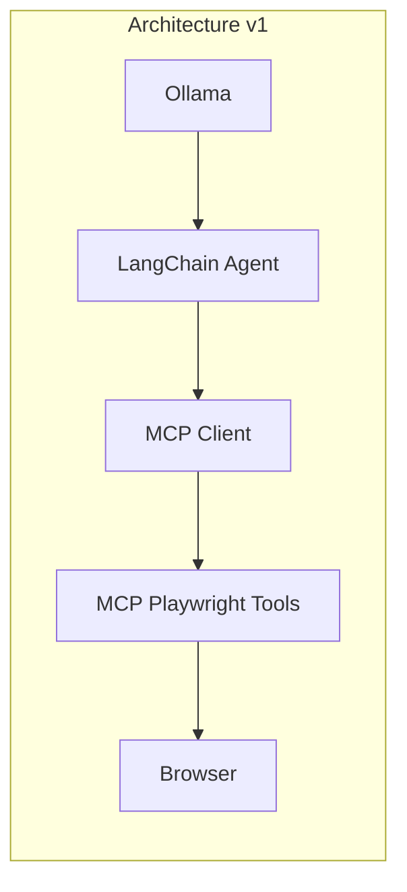
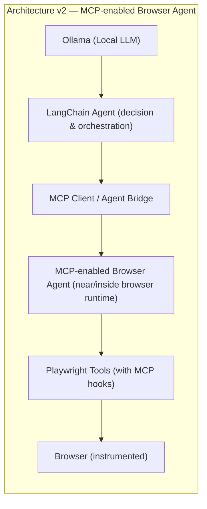

# 🤖 Autonomous Web AI Agent (Playwright + Local LLM)

An enterprise-ready architectural sample demonstrating how to integrate **Playwright** with **Large Language Models (LLMs)** for autonomous web automation and self-healing test scenarios.

## 🚀 Features & Visibility Highlights
* **100% Free & Open-Source:** Utilizes **Ollama** locally—no paid OpenAI or Anthropic API keys required.
* **Agentic Execution Loop:** The LLM acts as the decision engine by evaluating page options dynamically, while Playwright drives the browser.
* **CI/CD Ready:** Configured to run headlessly inside open-source, self-hosted instances of **Jenkins**.

## 🛠️ Tech Stack
* **Browser Automation:** Playwright (Chromium)
* **AI Orchestration Framework:** LangChain
* **LLM Engine:** Ollama (`qwen2.5-coder:7b`)
* **Language:** TypeScript / Node.js

## Architecture
Below are two architecture views (v1 and v2) and a brief explanation of the agent flow and version breakdowns.

### Quick pipeline (high-level)
```
Ollama
  ↓
LangChain Agent
  ↓
MCP Client
  ↓
MCP Playwright Tools
  ↓
Browser
```

### Architecture (v1)

```
Ollama
  ↓
LangChain Agent
  ↓
MCP Client
  ↓
MCP Playwright Tools
  ↓
Browser
```

This repository originally implements the v1 architecture focused on AI-assisted Playwright automation with a locally-hosted LLM (Ollama) driving decisions via LangChain and Playwright acting on the browser.

### Architecture (v2) — MCP-enabled Browser Agent

```
Ollama (Local LLM)
  ↓
LangChain Agent (decision & orchestration)
  ↓
MCP Client / Agent Bridge
  ↓
MCP-enabled Browser Agent (runs near/inside browser runtime)
  ↓
Playwright Tools (enhanced with MCP hooks)
  ↓
Browser (instrumented)
```

v2 moves more capability closer to the browser (MCP-enabled browser agent) so that specialized browser-side tools can react faster, capture richer traces, and run lightweight validation/repair logic with lower latency.

### Visual diagrams (Mermaid)

The diagrams below render the same v1/v2 flows as above — they can be viewed on GitHub's Markdown renderer that supports Mermaid diagrams.





## Version Breakdown

### V1 — Current Project: AI-assisted Playwright Automation

**Core Features:**
- TypeScript
- Playwright
- Page Object Model
- Data-driven tests
- Ollama (local LLM)
- LangChain
- Jenkins (CI integration)

**Capabilities:**
- Basic autonomous web automation
- LLM-driven navigation and decision-making
- Playwright browser control
- CI/CD integration via Jenkins

---

### V1.5 — AI-assisted Locator Intelligence

**Enhanced Capabilities:**
- DOM extraction
- Locator identification
- Structured LLM output
- Locator validation
- Failure analysis

**Improvements over V1:**
- Intelligent element locator detection using LLM analysis
- Dynamic locator validation against current DOM state
- Failure recovery through AI-assisted locator correction
- Structured output for improved reliability

---

### V2 — MCP-enabled Browser Agent *(Coming Soon)*

**Enhanced Capabilities:**
- MCP-enabled browser agent
- Moves validation and quick-retry/repair logic closer to the browser
- Improves signal fidelity with richer traces, DOM hooks, and lower-latency checks
- Enables hybrid execution: some decisions locally in browser agent, heavier reasoning in central LLM
- Faster candidate validation and safer, targeted retries

---

### V3 — AI-assisted Self-Healing Tests *(Planned/Aspirational)*

**Future Enhancements:**
- AI-assisted self-healing tests
- Continuous learning of locator patterns and robustness metrics
- Automated test repair suggestions and safe push-to-suite workflows

---

## Failure Handling & Retry Flow (V1 → V2 Evolution)

The typical failure and self-healing flow looks like:

```
Failure
 ↓
DOM / Trace / Screenshot (collected)
 ↓
LLM (analysis)
 ↓
Candidate locator(s) (from structured LLM output)
 ↓
Validation (run candidate(s) against current DOM / browser)
 ↓
Retry (with validated locator)
 ↓
Report (outcome, metrics, artifacts)
```

In v2 the "Validation" and some "Candidate locator" heuristics can run inside the MCP-enabled browser agent or as a hybrid step to reduce latency and improve repair success rates.

## 💻 Local Setup & Execution

### 1. Download Ollama
Install [Ollama](https://ollama.com) on your host machine and pull the optimized coding model via terminal:
```bash
ollama run qwen2.5-coder:7b
```

### 2. Run the Project
```bash
# Clone the repository
git clone https://github.com/divijqa/playwright-ai-agent
cd playwright-ai-agent

# Install dependencies
npm install

# Run the autonomous script
npx tsx agent.ts
```

## 🏗️ Jenkins Integration (Free Version)
To deploy this setup inside your self-hosted Jenkins server, point a **Pipeline Job** directly to this repository root using the following script:

```groovy
pipeline {
    agent any
    stages {
        stage('Environment Check') {
            steps {
                sh 'node -v'
                sh 'npm -v'
            }
        }
        stage('Install & Test') {
            steps {
                sh 'npm install'
                sh 'npx playwright install chromium'
                sh 'npx tsx agent.ts'
            }
        }
    }
    post {
        always {
            // Archive screenshots generated by the AI agent for visibility
            archiveArtifacts artifacts: 'screenshots/*.png', allowEmptyArchive: true
        }
    }
}
```
